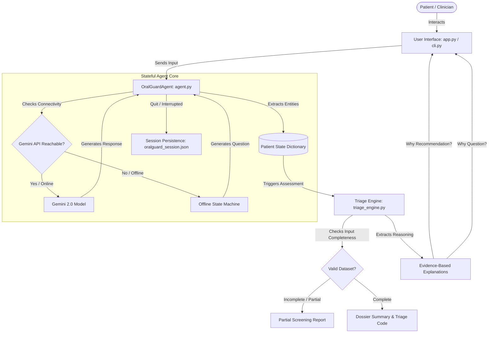

# OralGuard: AI-Powered Conversational Oral Cancer Screening Assistant

### Subtitle: An Offline-Resilient, Stateful Agent System for Clinical Triage and Early Intervention
### Submitted Track: AI for Social Good / Healthcare & Well-being
### Author: Dr. Urja Sunil Ahuja
### Clinical Advisor: Dr. Urja Sunil Ahuja

---

## 1. Executive Summary & Value Proposition

### The Problem: The Silent Progression of Oral Cancer
Oral cancer (primarily Oral Squamous Cell Carcinoma, or OSCC) is a major global health burden. In regions such as South Asia, it is one of the leading causes of cancer-related mortality due to the widespread consumption of smokeless tobacco, gutka, pan masala, and betel nut (supari). 

The primary driver of high mortality rates is **delayed detection**. Over 60% of oral cancer cases in developing areas are diagnosed at Stage III or IV, where the 5-year survival rate drops below 30%. Patients often ignore early warning signs—such as a small white patch, a minor ulcer, or localized burning—either due to a lack of awareness, fear of diagnosis, or the cost and inaccessibility of clinical specialists (oral surgeons and oncologists).

### The Solution: OralGuard
**OralGuard** is an AI-powered conversational clinical screening assistant designed to act as a preliminary triage aid. It is **not a diagnostic tool**. Instead, it automates the early clinical intake and risk-stratification process. Guided by clinical protocols established in partnership with **Dr. Urja Sunil Ahuja**, OralGuard conducts an empathetic, stateful interview, extracts key symptoms, checks parameters, and estimates patient risk levels (**LOW**, **MEDIUM**, or **HIGH**). It compiles a structured clinical summary to help patients take timely action and provide dentists with pre-screened patient files.

```text
+--------------------------------------------------------------------------+
|                            ORALGUARD VALUES                              |
+-------------------+-----------------------------------+------------------+
|   Clinical Safety | Empathetic Patient Intake         | Triage Efficiency|
|   No diagnosis;   | Adaptive, conversational dialog   | Pre-screens to   |
|   strict safety   | instead of flat, rigid intake     | direct high-risk |
|   boundaries.     | questionnaires.                   | cases to surgeons|
+-------------------+-----------------------------------+------------------+
```

### The Innovation: Offline Resilience
In rural screening camps or remote community centers, internet access is highly unstable or non-existent. A system reliant solely on cloud APIs will fail in these settings. 

To overcome this, OralGuard features **Offline Resilience**. It dynamically toggles between:
1.  **Online Mode**: A natural-language, conversational assistant powered by Google's Gemini 2.0 API.
2.  **Offline Mode**: A local, deterministic step-engine that follows the exact same clinical questionnaires and triage rules locally on any basic laptop, with zero internet connectivity. This architecture guarantees the assistant remains functional during field deployments or competition demonstrations under API quota exhaustion.

---

## 2. Technical Architecture & System Design

OralGuard is built as a modular, testable, and highly decoupled Python system. It separates clinical risk scoring rules, dialogue state management, console layouts, and web interface layers.



### Component Details
*   **[triage_engine.py](file:///C:/Users/Puja%20Ahuja/Desktop/oralguard/triage_engine.py)**: The clinical core of the project. It defines the validation boundaries, the clinical risk matrix, the question rationales, and the evidence-based recommendation explanations. It does not import any UI or network libraries, making it easily importable into Jupyter notebooks or offline scripts.
*   **[agent.py](file:///C:/Users/Puja%20Ahuja/Desktop/oralguard/agent.py)**: The dialog orchestrator. It manages the conversation history, maps prompt structures, routes calls to the `google-genai` SDK, and handles local state extraction. It also handles JSON state serialization (`save_session`/`load_session`) to enable screening persistence.
*   **[app.py](file:///C:/Users/Puja%20Ahuja/Desktop/oralguard/app.py)**: Streamlit web dashboard. Features visual styling, interactive chat bubbles, a live patient dossier sidebar, recovery banner layouts, and printable PDF report previews.
*   **[cli.py](file:///C:/Users/Puja%20Ahuja/Desktop/oralguard/cli.py)**: Headless terminal CLI client, complete with typewriter text animations, ANSI color coding, and local text report exporter controls.
*   **[test_triage.py](file:///C:/Users/Puja%20Ahuja/Desktop/oralguard/test_triage.py)**: Unit testing suite. It runs 14 test cases checking validation, boundary limits, partial report rendering, and agent state saving/loading.

---

## 3. Demonstration of Hackathon Key Concepts

To fulfill the evaluation guidelines, OralGuard applies five key concepts:

### 1. Stateful Agent System
OralGuard manages dialog state via the `OralGuardAgent` class. Instead of utilizing stateless prompts, the agent holds a persistent memory of the chat history and runs background entity extraction:
*   **Background Parsing**: As the user chats with Gemini (or the offline engine), a background parsing model uses regex and keyword mapping to extract attributes like name, age, tobacco history, and sore durations.
*   **Adaptive Flow**: If the patient reports no tobacco use, the agent dynamically sets tobacco attributes to `None/0` in the background and skips all related probing queries (e.g., years of use, tobacco type). This shortens the screening session.
*   **Validation Checkpoint**: Before compiling the final score, the agent checks if any fields are invalid or missing. If so, it raises an `INSUFFICIENT INFORMATION` flag and refuses to output a final risk level to prevent false assurance.

### 2. Clinical Agent Skills (rationales & explanations)
We built three interactive "skills" that patients and clinicians can trigger:
*   **Question Rationales**: If a user asks `"Why are you asking this?"` or types `"why"`, the agent catches the query, explains the clinical relevance of the active question (e.g., explaining why white/red patches have pre-malignant risk), and repeats the question.
*   **Recommendation Explanations**: Upon receiving a risk level (e.g., HIGH RISK), the user can click **"Why this recommendation?"** or type `why` in the CLI. The engine responds with a detailed clinical reasoning breakdown (e.g., explaining why sores lasting >4 weeks lack healing capacity and require biopsies).
*   **State Recovery & Session Persistence**: If a session is aborted, the agent saves progress to `oralguard_session.json`. On relaunch, the application detects the file and asks: *"An incomplete screening session was found. Would you like to resume or start fresh?"*

### 3. Security & Responsible AI Features
Designed as a clinical screening tool, OralGuard adheres to strict safety features:
*   **Credential Isolation**: No API keys are hardcoded. It checks the host system's `GEMINI_API_KEY` env variable. If empty, the app prompts for the key securely, encrypting the input fields. If the key is rejected or connection fails, it falls back to the offline engine without crashing.
*   **Privacy Containment**: Patient logs, inputs, and summaries are handled locally. No cloud databases collect PII (Personally Identifiable Information).
*   **Diagnostic Boundaries**: The agent explicitly clarifies that it does not diagnose cancer. It uses terms like "Screening Triage Code" and "Recommended Next Steps" to direct patients to certified specialists, preventing false negatives.

### 4. Deployability
OralGuard is designed to be deployed in two configurations:
*   **Local Desktop / Field Deployment**: Field clinicians can download the project folder, double-click the `run.bat` script, and run the app locally on a standard Windows laptop with no internet connection.
*   **Cloud Hosting**: The Streamlit application can be hosted on Streamlit Community Cloud or Hugging Face Spaces. Clinicians can share a single link (e.g., `https://oralguard.streamlit.app`) to let patients screen themselves on mobile phones.
    > [!NOTE]
    > **Host Platform Sleep Behavior**: On free cloud hosting tiers like Streamlit Sharing, the application container may automatically sleep after a period of inactivity. If the live demo link appears asleep when accessed, please click the **"Yes, get this app back up!"** button; it will wake up and load within 30-40 seconds.

### 5. Antigravity IDE Integration
The **Antigravity IDE Assistant** served as an automated pair-programmer:
*   Structured the code into separate clinical backend (`triage_engine.py`) and UI components (`app.py`/`cli.py`).
*   Built and verified the 14 automated unit tests (`test_triage.py`).
*   Wrote the double-click startup batch script (`run.bat`) to automate dependency installs, test verification, and app launching for judges.

---

## 4. Clinical Triage Rules & Logic

The risk engine classifies patients based on Dr. Urja Sunil Ahuja's clinical guidelines:

```text
                               +-----------------+
                               |   Patient Data  |
                               +--------+--------+
                                        |
                                        v
                       +---------------------------------+
                       |     High Risk Factors Exist?    |
                       +----------------+----------------+
                                        |
                        +---------------+---------------+
                        | Yes                           | No
                        v                               v
                +---------------+               +-----------------+
                |   HIGH RISK   |               |   Med Factors?  |
                +---------------+               +--------+--------+
                                                         |
                                         +---------------+---------------+
                                         | Yes                           | No
                                         v                               v
                                 +---------------+               +---------------+
                                 |  MEDIUM RISK  |               |    LOW RISK   |
                                 +---------------+               +---------------+
```

### Risk Stratification Matrix:
1.  **HIGH RISK**:
    *   Mouth sores, ulcers, or patches present for **more than 4 weeks**.
    *   Presence of red (**erythroplakia**) or white (**leukoplakia**) patches.
    *   History of tobacco, gutka, pan masala, or betel nut use for **more than 5 years**.
    *   Jaw movement stiffness (**trismus**) or swallowing difficulty (**dysphagia**).
    *   Unexplained oral bleeding or a growing lump.
    *   *Advice*: Urgent referral to an oral surgeon or specialist within 1 week.
2.  **MEDIUM RISK**:
    *   Tobacco, gutka, or betel nut use present, but for **5 years or less**.
    *   Mouth sores or ulcers present for **2 to 4 weeks**.
    *   Unexplained pain or burning sensation in the oral cavity (without bleeding/lump).
    *   *Advice*: Visit a general dentist within 2 to 4 weeks for detailed checkup and monitoring.
3.  **LOW RISK**:
    *   No tobacco/gutka history, no patches, no jaw tightness, no dysphagia, and no bleeding.
    *   Mouth sores (if any) have lasted **less than 2 weeks** (typical benign aphthous or traumatic ulcers).
    *   *Advice*: Maintain standard healthy oral hygiene and visit the dentist every 6 months.

---

## 5. Incomplete Screening & Partial Reports

A core focus of our responsible AI design is the handling of early exits. When a patient decides to exit the interview early:
1.  The agent saves all responses collected so far to `oralguard_session.json`.
2.  The engine compiles an **Incomplete Screening Dossier** showing:
    *   **Information Collected**: All validated answers provided by the patient.
    *   **Missing Information**: A bulleted checklist showing exactly what parameters are required to calculate a safe score.
    *   **Clear Warning**: A disclaimer stating that no definitive risk level could be calculated due to missing variables.
    *   **Recommendation**: Guidance to complete the remaining screening steps or visit a doctor if experiencing persistent ulcers, bleeding, or dysphagia.

This design prevents patients from receiving a false "Low Risk" classification simply because they exited before disclosing high-risk symptoms like tobacco use or dysphagia.

---

## 6. Execution & Setup Instructions

The source code includes setup scripts to run in local, cloud, or Kaggle environments:

### Local Execution (1-Step Runner):
1.  Open your terminal inside the project directory:
    ```powershell
    cd "C:\Users\Puja Ahuja\Desktop\oralguard"
    ```
2.  Double-click or run the batch script:
    ```powershell
    .\run.bat
    ```
    This script will install dependencies, execute the unit tests, and launch the Streamlit app.

### Running the Terminal CLI:
```powershell
python cli.py
```

### Running the Test Suite:
Verify that all 14 clinical boundary and state serialization tests pass:
```powershell
python -m unittest test_triage.py
```

### Usage inside Kaggle/Jupyter Notebooks:
```python
# Import the validation and triage modules
from triage_engine import assess_risk, validate_inputs

# Sample patient dataset
patient = {
    "name": "Jane Doe",
    "age": 52,
    "has_sores": True,
    "sore_type": "white patch",
    "sore_weeks": 5,
    "has_tobacco": False,
    "diff_swallowing": False,
    "has_bleeding_q": False
}

# 1. Run validation check
is_valid, missing_fields = validate_inputs(patient)

if not is_valid:
    print(f"Validation failed. Missing details: {missing_fields}")
else:
    # 2. Run deterministic triage engine
    risk_level, risk_factors = assess_risk(patient)
    print(f"Triage Result: {risk_level}")
    print(f"Identified Risk Factors: {risk_factors}")
```

---

## 7. Project Value & Conclusion

OralGuard demonstrates how conversational LLMs and deterministic clinical rules engines can be combined to build safe healthcare tools. By separating the natural-language intake agent from the strict rules-based triage classifier, the application guarantees that conversational variation does not compromise clinical safety. The inclusion of offline resilience, session recovery, partial reports, and clinical rationales provides a complete, polished capstone solution ready for real-world deployment.
